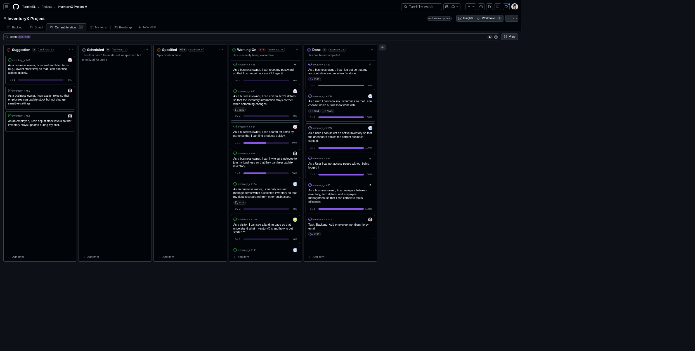

# Standup – 2026-02-24

## Purpose

The purpose of this standup was to synchronize progress, identify blockers, agree on next steps, and update the GitHub Project board.

## Summary

The team reviewed work on the landing page, authentication, password reset, invite users, permissions, and open pull requests. Some work was waiting for changes to be merged into main.

## Team updates

- Ann-Hilde worked on the landing page and needed to add a test.
- Lotte was still waiting for required work to be merged into main and was considering a backend task for authentication. She planned to discuss it with Daniel after the standup.
- Chai designed the reset password solution and suggested a new user story for email confirmation when email services were available. No blockers were reported.
- Daniel worked through assigned pull requests and planned to fix permissions so that Lotte would be unblocked. After that, he would continue the invite user story.
- Knut-Åge was absent because of an exam.
- Torgrim was nearly finished with his user stories and was receiving pull request feedback.

## Blockers

Lotte was waiting for required merges into main. Daniel planned to fix permissions to unblock that work. No other major blockers were reported.

## Board update

The GitHub Project board was reviewed and updated during the meeting.

A board snapshot from this meeting is included below.

## Action items

- Add test coverage for the landing page.
- Follow up on authentication backend task.
- Fix permissions to unblock dependent work.
- Continue invite user story.
- Continue pull request reviews and feedback.
