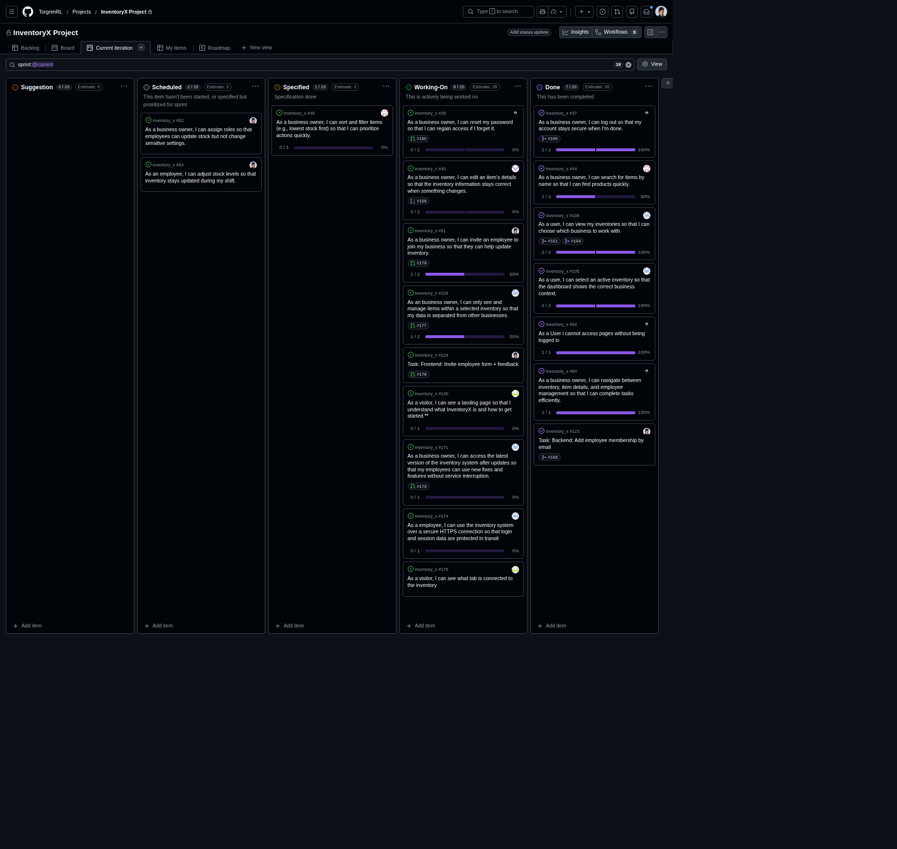

# Standup – 2026-02-27

## Purpose

The purpose of this standup was to synchronize progress, identify blockers, agree on next steps, and update the GitHub Project board.

## Summary

This standup was originally recorded in Discord. The team reviewed ongoing Sprint 2 work on the landing page, permissions, invite employees, production bug fixes, smoke testing, and report preparation.

## Team updates

- Ann-Hilde had limited progress since the previous standup because of other assignments. She had added tests and continued work on the landing page user story (#140), looked into making the implementation more modular, and created a new user story for changing the browser tab icon and title. No blockers were reported.
- Lotte had also focused more on other assignments. The permission class for checking membership role had been added, which meant user story #40 could continue. No blockers were reported.
- Torgrim had limited progress since the previous standup, fixed a bug in the live version, planned to review pull requests, and had defined a smoke test user story to later add to the GitHub Actions workflow. He had also started looking more into the report. No blockers were reported.
- Daniel had finished and created a pull request for inviting employees to an inventory (#51), which needed review. He planned to continue with other user stories before the next standup. No blockers were reported.

## Blockers

No blockers were reported.

## Board update

The GitHub Project board was reviewed and updated during the meeting.

A board snapshot from this meeting is included below.

## Action items

- Review the invite employees pull request.
- Continue landing page work and related tests.
- Continue user story #40 now that membership role permissions are available.
- Continue planning the smoke test workflow.
- Continue report preparation.
