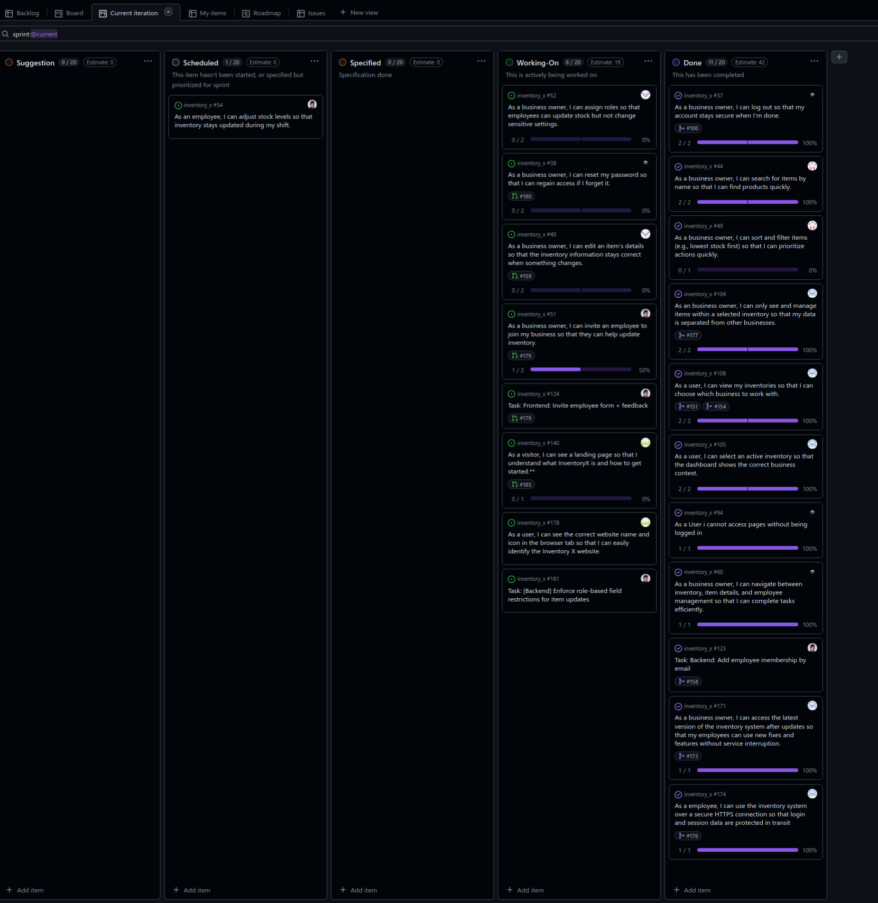

# Standup – 2026-03-03

## Purpose

The purpose of this standup was to synchronize progress, identify blockers, agree on next steps, and update the GitHub Project board.

## Summary

The team reviewed the final Sprint 2 work. Several user stories were close to merge or already completed. Work included invite employee, password reset, landing page, browser tab update, editing item details, search/filtering, and backend refactoring.

## Team updates

- Daniel had fixed the invite employee user story. It was ready to merge once the backend part of edit item details had been merged. He had also refactored the backend in a separate pull request by splitting large files into smaller files and was reviewing pull requests.
- Chai had finished the forgot password story and only needed a shared mail service.
- Ann-Hilde had a pull request for the landing page and had tried to make it more modular with different themes. She was also working on a user story for updating the browser tab and expected to create a pull request soon.
- Lotte had finished and created a pull request for the backend story for changing item name and price. She was working on the remaining frontend part.
- Knut-Åge had finished two user stories. One was already merged into main, and another pull request had been approved but needed conflicts resolved.
- Torgrim done with his user story, spending rest of sprint reviewing and merging pull requests.

## Blockers

Some work depended on the edit item details backend being merged. Knut-Åge had merge conflicts to resolve. No other blockers were reported.

## Board update

The GitHub Project board was reviewed and updated during the meeting.

A board snapshot from this meeting is included below.

## Action items

- Merge edit item details backend when ready.
- Merge invite employee after the dependency is resolved.
- Set up or agree on a shared mail service.
- Resolve merge conflicts in approved pull requests.
- Continue frontend work for edit item details.
