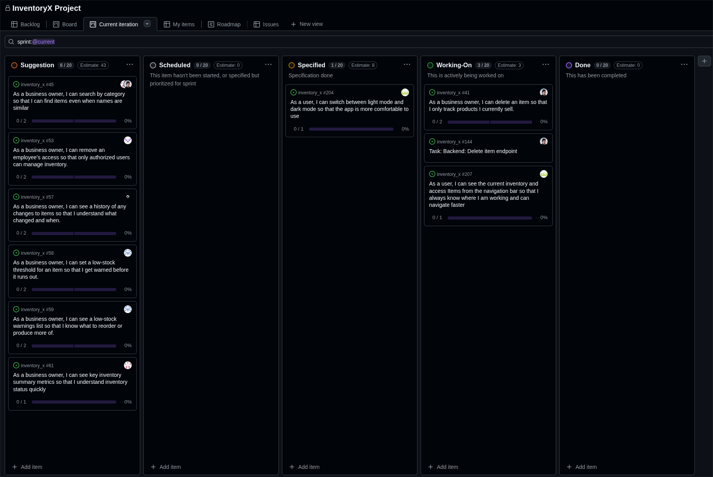

# Standup – 2026-03-06

## Purpose

The purpose of this asynchronous standup was to synchronize progress, identify blockers, agree on next steps, and update the GitHub Project board.

## Summary

This standup was recorded in Discord. The team reviewed early Sprint 3 work on the navbar, delete items, KPI functionality, backend review, and upcoming implementation tasks.

## Team updates

- Torgrim had not started his assigned work yet. No blockers were reported.
- Ann-Hilde had started working on the navbar user story (#207). No blockers were reported.
- Lotte had not started her assigned work yet. No blockers were reported.
- Daniel had reviewed Chai's password reset pull request and started implementing the delete items user story. No blockers were reported.
- Knut-Åge had started the KPI user story and reviewed Daniel's backend restructuring. No blockers were reported.

## Blockers

No blockers were reported.

## Board update

The GitHub Project board was reviewed and updated around this asynchronous standup.

A board snapshot from the same period is included below.

## Action items

- Continue navbar work.
- Continue delete item implementation.
- Continue KPI work.
- Continue reviewing backend restructuring and related pull requests.
