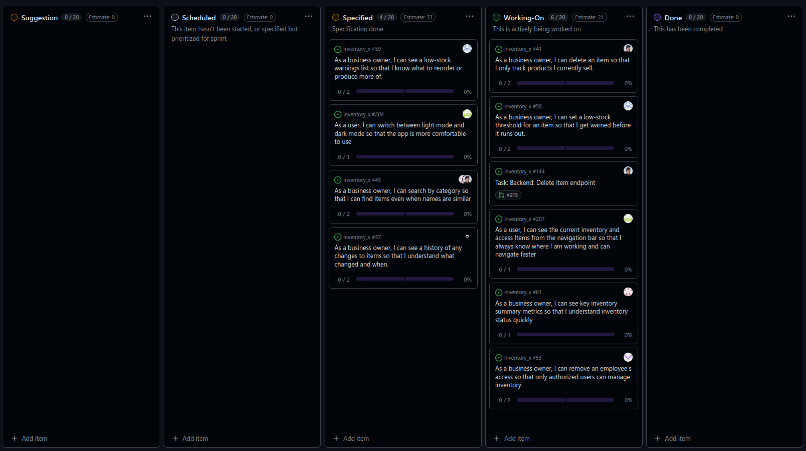

# Standup – 2026-03-10

## Purpose

The purpose of this standup was to synchronize progress, identify blockers, agree on next steps, and update the GitHub Project board.

## Summary

The team reviewed ongoing Sprint 3 work. The main work areas were delete item, reset password, stock history, navbar improvements, inventory members, key inventory information, and low-stock functionality.

## Team updates

- Daniel had created a backend pull request for deleting items and was waiting for review. He planned to start the frontend task for the same user story. No blockers were reported.
- Chai was fixing a reset password bug in production and planned to create a pull request for stock history after the bug fix. No blockers were reported.
- Ann-Hilde had added an items button to the navbar, made the active inventory visible, marked the current page, fixed the hamburger menu for small devices, and was updating tests. No blockers were reported.
- Lotte had finished the backend work for removing memberships and listing inventory members. A pull request was expected soon. No blockers were reported.
- Knut-Åge was close to finishing the key information user story and expected to create a pull request soon. He also had a pair programming task planned with Daniel. No blockers were reported.
- Torgrim started the backend work for the low-stock user story. No blockers were reported.

## Blockers

No major blockers were reported.

## Board update

The GitHub Project board was reviewed and updated during the meeting.

A board snapshot from this meeting is included below.

## Action items

- Review Daniel's delete item backend pull request.
- Continue frontend work for delete item.
- Finish the reset password production bug fix.
- Start stock history pull request after the bug fix.
- Continue inventory member and membership removal work.
- Continue low-stock backend work.
