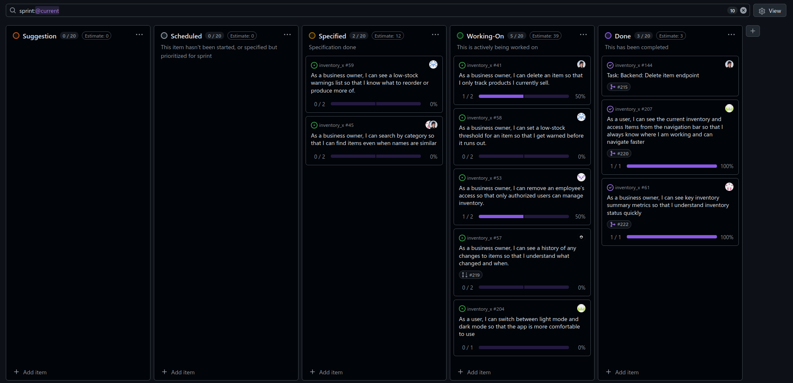

# Standup – 2026-03-13

## Purpose

The purpose of this standup was to synchronize progress, identify blockers, agree on next steps, and update the GitHub Project board.

## Summary

The team reviewed progress on delete item, stock history, navbar updates, dark mode, removing employees from inventories, KPI functionality, categories, and per-item low-stock thresholds.

## Team updates

- Daniel had finished the delete item backend work. The backend was ready but waiting for approval. He was also working on the frontend, which was close to completion, and planned to create a pull request soon. He also planned to contact Knut-Åge about a pair programming task for categories.
- Chai was working on the stock history story. Both frontend and backend functionality were ready, but tests were still missing.
- Ann-Hilde had merged the navbar changes showing items and names. She was working on the dark mode user story and creating a CONTRIBUTING.md file. No blockers were reported.
- Lotte had merged the backend part of removing employees from inventories and was working on the frontend. No blockers were reported.
- Knut-Åge had merged the KPI user story and was coordinating with Daniel on the pair programming task for implementing categories.
- Torgrim had started the backend work for the per-item low-stock threshold story. No blockers were reported.

## Blockers

No major blockers were reported. Some work was waiting for review or missing tests.

## Board update

The GitHub Project board was reviewed and updated during the meeting.

A board snapshot from this meeting is included below.

## Action items

- Approve or follow up on the delete item backend pull request.
- Finish delete item frontend work.
- Add tests for stock history.
- Continue dark mode and CONTRIBUTING.md work.
- Continue frontend work for removing employees from inventories.
- Continue category implementation planning.
- Continue per-item low-stock threshold backend work.
