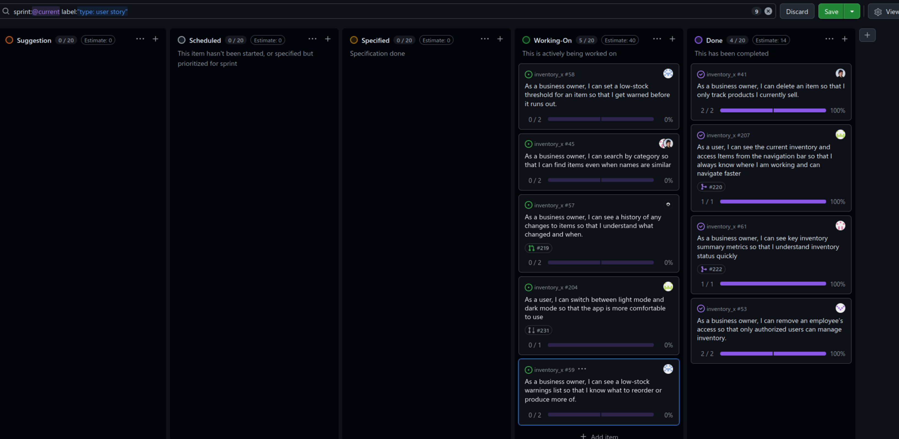

# Standup – 2026-03-17

## Purpose

The purpose of this standup was to synchronize progress, identify blockers, agree on next steps, and update the GitHub Project board.

## Summary

The team reviewed late Sprint 3 progress. Several features were merged or close to completion, including delete item, category work, stock log, dark mode, employee access removal, pagination, and per-item low-stock thresholds. Some members also started reviewing pull requests and working on report-related tasks.

## Team updates

- Daniel had merged delete item into main. He had started the category user story together with Knut-Åge, and the backend part was close to completion. Tests and seed updates remained. He planned to continue working with Knut-Åge on the frontend. No blockers were reported.
- Chai was updating the stock log branch with changes from main and planned to fix the forgot password bug.
- Ann-Hilde was working on dark mode, including a switch in the navbar, tests, migration of older non-MUI components to MUI, persistent dark mode, and the CONTRIBUTING file. She was finishing the related pull request and planned to review assigned pull requests afterwards. The mobile menu was also handled. No blockers were reported.
- Lotte had finished and merged work related to removing employee access. She had completed her planned sprint work, saw potential for improving the user experience of the adjust stock modal, fixed a bug in edit/add item, and worked on pull request reviews.
- Knut-Åge was working on the frontend part of categories and also added pagination. No blockers were reported.
- Torgrim had finished the per-item low-stock threshold user story and was waiting for reviews. He was also researching material for the shared report. No blockers were reported.

## Blockers

No major blockers were reported. Some work was waiting for reviews.

## Board update

The GitHub Project board was reviewed and updated during the meeting.

A board snapshot from this meeting is included below.

## Action items

- Finish tests and seed updates for category backend work.
- Continue category frontend work.
- Update stock log branch with main.
- Fix the forgot password bug.
- Finish and review the dark mode pull request.
- Review the per-item low-stock threshold pull request.
- Continue report research.
