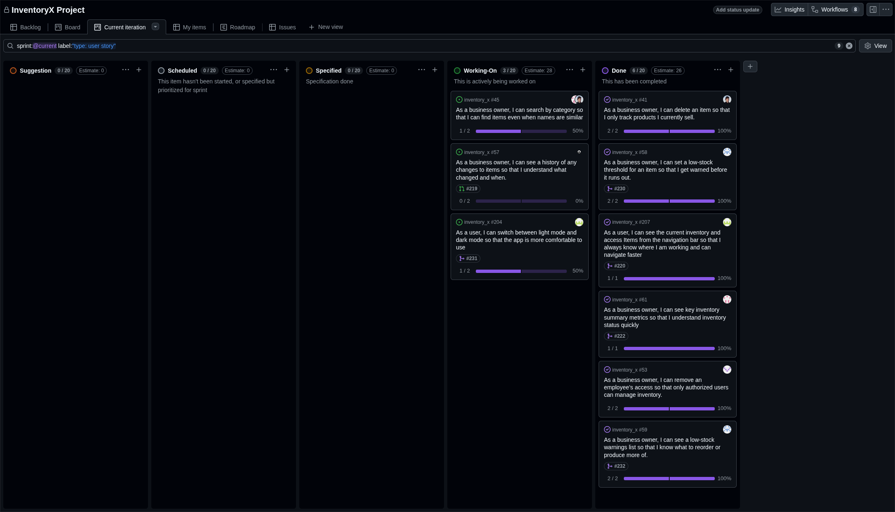

# Standup – 2026-03-20

## Purpose

The purpose of this standup was to synchronize progress, identify blockers, agree on next steps, and update the GitHub Project board.

## Summary

The team reviewed ongoing Sprint 3 work on the inventories page, dark and light mode, register inventory, inventory selection, employee access removal, categories, and backlog refinement. Most members reported no blockers.

## Team updates

- Ann-Hilde investigated the inventories page and planned to update it so it worked better with both dark and light mode. She also planned to continue work on the register inventory page and inventory selection page. No blockers were reported.
- Lotte had finished the user story for removing access for employees. She also fixed the save button being disabled when no changes had been made. No blockers were reported.
- Torgrim had finished his user stories and planned to go through existing user stories, suggest specifications, and add new suggestions before the next meeting. No blockers were reported.
- Daniel and Knut-Åge worked on categories. The backend was finished, and the frontend was almost done. Some minor changes were still needed before the user story was ready for a pull request. No blockers were reported.

## Blockers

No blockers were reported.

## Board update

The GitHub Project board was reviewed and updated during the meeting.

A board snapshot from this meeting is included below.

## Action items

- Continue inventories page improvements for dark and light mode.
- Continue register inventory and inventory selection work.
- Continue category frontend work and prepare the pull request.
- Review existing user stories and improve specifications before the next meeting.
