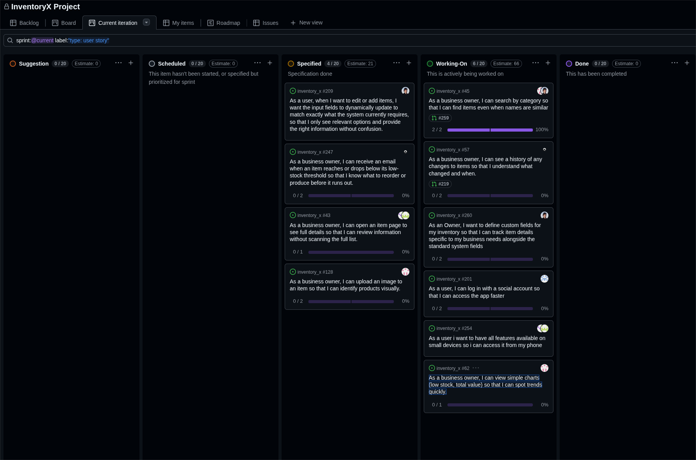

# Standup – 2026-03-27

## Purpose

The purpose of this standup was to synchronize progress, identify blockers, agree on next steps, and update the GitHub Project board.

## Summary

This standup was originally recorded in Discord. The team reviewed early Sprint 4 work on pull request reviews, mobile-friendly design, item descriptions, categories, charts, custom fields, stock log, low-stock email, and social login.

## Team updates

- Lotte reviewed pull requests and followed up on related questions.
- Ann-Hilde and Lotte had started getting an overview of the mobile-friendly version user story and were planning the solution for per-item descriptions. No blockers were reported.
- Knut-Åge had submitted the category pull request and continued working on additional charts. Some natural statistics depended on history data from Chai's history user story. He planned to start the item image story afterwards. No blockers were reported.
- Daniel had prepared the categories pull request and started the custom fields per inventory story. He pushed tests first because the team was practicing TDD. No blockers were reported.
- Chai discussed whether the stock log could be merged partially and planned to talk to Daniel. After that, he planned to work on email notifications for low stock. No blockers were reported.
- Torgrim worked on the social media login story to support two-factor authentication and expected to include the account user image in the navbar if possible. No blockers were reported.

## Blockers

No major blockers were reported. Some chart work depended on history functionality being completed.

## Board update

The GitHub Project board was reviewed and updated during the meeting.

A board snapshot from this meeting is included below.

## Action items

- Continue pull request reviews.
- Continue mobile-friendly design and per-item description planning.
- Continue chart work after history data becomes available.
- Continue custom fields using the TDD workflow.
- Discuss partial merge of stock log work.
- Continue low-stock email work.
- Continue social login and two-factor authentication work.
