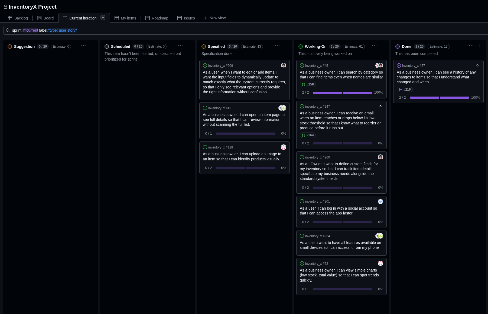

# Standup – 2026-03-31

## Purpose

The purpose of this asynchronous standup was to synchronize progress, identify blockers, agree on next steps, and update the GitHub Project board.

## Summary

This standup was recorded in Discord. The team reviewed work on Auth0, low-stock notification, custom fields, categories, mobile-friendly design, dashboard charts, image upload, and user testing. The team also reminded each other to commit tests before implementation and include a short reflection on test-driven development in pull requests with code.

## Team updates

- Torgrim continued working on Auth0. No blockers were reported.
- Chai was working on low-stock notification and expected it to be ready for a pull request during the day. After that, he planned to continue with user testing.
- Daniel was about 90% finished with the backend part of the custom fields user story and only needed to define seed data for inventories with their own fields. He also planned to finalize the categories work with Knut-Åge and make it ready for review again. No blockers were reported.
- Lotte worked on making the site mobile-friendly. No blockers were reported.
- Knut-Åge worked on categories while Daniel handled the final parts. He also needed to update the dashboard charts now that stock log was live and planned to start image work. No blockers were reported.
- Ann-Hilde also worked on making the site more mobile-friendly. No blockers were reported.

## Process reminders

- Commit a test before implementation when practicing TDD.
- Add a short reflection on test-driven development in pull requests with code.

## Blockers

No blockers were reported.

## Board update

The GitHub Project board was reviewed and updated during the meeting.

A board snapshot from this meeting is included below.

## Action items

- Continue Auth0 work.
- Finish low-stock notification and prepare a pull request.
- Continue user testing.
- Finish custom fields backend seed data.
- Prepare categories for review.
- Continue mobile-friendly design work.
- Update dashboard charts based on stock log.
- Start or continue image work.
