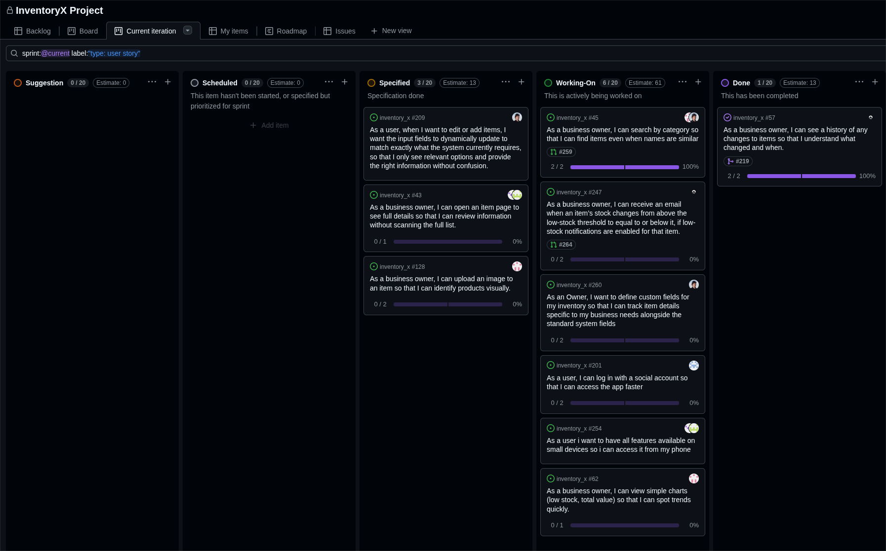

# Standup – 2026-04-08

## Purpose

The purpose of this standup was to synchronize progress, identify blockers, agree on next steps, and update the GitHub Project board.

## Summary

The team reviewed ongoing Sprint 4 work. The main work areas were mobile-friendly design, item details, custom fields, invitation email, user testing, charts, image upload, and two-factor/social login.

## Team updates

- Lotte continued working on mobile-friendly design and planned to move on to item details afterwards.
- Ann-Hilde pair programmed with Lotte and had completed two user tests.
- Daniel continued working on custom fields. The backend was almost finished, with seed data remaining, and he worked on the frontend in parallel.
- Chai had implemented email for inventory invitations and worked on user testing. No blockers were reported.
- Knut-Åge worked on charts and waited for categories to be merged into main. He also worked on image upload while waiting.
- Torgrim continued working on two-factor/social login. No blockers were reported.

## Blockers

Knut-Åge was waiting for categories to be merged into main before continuing some chart-related work. No other blockers were reported.

## Board update

The GitHub Project board was reviewed and updated during the meeting.

A board snapshot from this meeting is included below.

## Action items

- Continue mobile-friendly design work.
- Continue item details after mobile-friendly work is completed.
- Finish custom fields backend seed work and continue frontend work.
- Continue user testing.
- Continue chart work after categories are merged.
- Continue image upload work.
- Continue two-factor/social login work.
