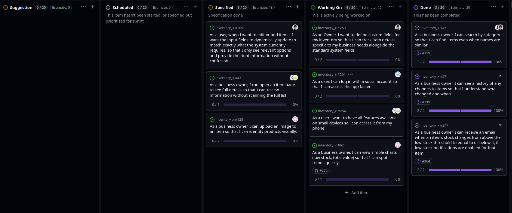

# Standup – 2026-04-10

## Purpose

The purpose of this asynchronous standup was to synchronize progress, identify blockers, agree on next steps, and update the GitHub Project board.

## Summary

This standup was recorded in Discord. The team reviewed ongoing Sprint 4 work on Auth0, dashboard charts, item images, invitation email, custom fields, mobile-friendly design, and item details.

## Team updates

- Torgrim worked on Auth0 and had created backend tests, a contract, and an endpoint. No blockers were reported.
- Knut-Åge had created a pull request for dashboard charts and continued working on item images. The item image work might be finished during the weekend. No blockers were reported.
- Chai planned to review the dashboard charts pull request and continue with the final user story for email notification when someone is invited to InventoryX.
- Daniel had turned his frontend draft into a pull request. He planned to finish the backend part, double-check that the frontend still worked, and either create a pull request for it or continue frontend work. No blockers were reported.
- Lotte continued working on making the site mobile-friendly and expected it to be finished soon. She planned to start the user story for viewing details about each item afterwards. No blockers were reported.
- Ann-Hilde worked on the same mobile-friendly work as Lotte. No blockers were reported.

## Blockers

No blockers were reported.

## Board update

The GitHub Project board was reviewed and updated during the meeting.

A board snapshot from this meeting is included below.

## Action items

- Continue Auth0 backend work.
- Review dashboard charts pull request.
- Continue item image work.
- Continue invitation email work.
- Finish custom fields backend/frontend work.
- Finish mobile-friendly design work.
- Start item details work after mobile-friendly work is completed.
