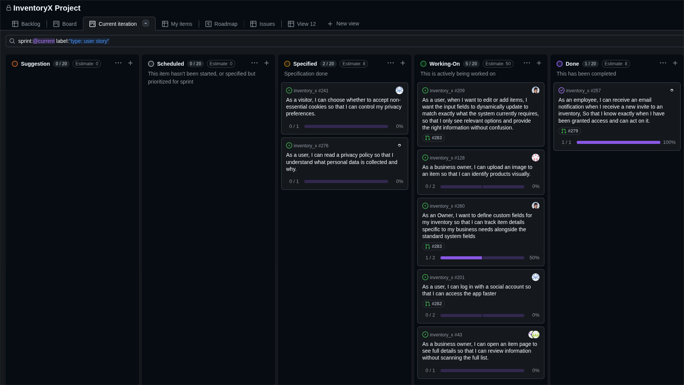

# Standup – 2026-04-17

## Purpose

The purpose of this standup was to synchronize progress, identify blockers, agree on next steps, and update the GitHub Project board.

## Summary

This standup was originally recorded in Discord. The team reviewed ongoing Sprint 5 work on two-factor login, item images, item descriptions, custom fields integration, and report preparation.

## Team updates

- Torgrim had finished the two-factor authentication work. He planned to wait before merging the pull request so that he could handle potential issues when ready. No blockers were reported.
- Knut-Åge worked on item images and coordinated with Lotte and Ann-Hilde because of dependencies on the descriptions feature. He was also ready to work on the report. No blockers were reported.
- Ann-Hilde had reviewed Torgrim's pull request and continued work on the item details model. She worked on integrating it with custom fields and refactoring. No blockers were reported.
- Lotte worked on the same area as Ann-Hilde through pair programming. No blockers were reported.
- No individual updates were recorded for Daniel or Chai in the meeting notes.

## Blockers

No blockers were reported for the recorded updates.

## Board update

The GitHub Project board was reviewed and updated during the meeting.

A board snapshot from this meeting is included below.

## Action items

- Prepare to merge the two-factor authentication pull request when ready.
- Continue item image work and coordinate with the descriptions feature.
- Continue item details, custom fields integration, and refactoring.
- Continue report work.
