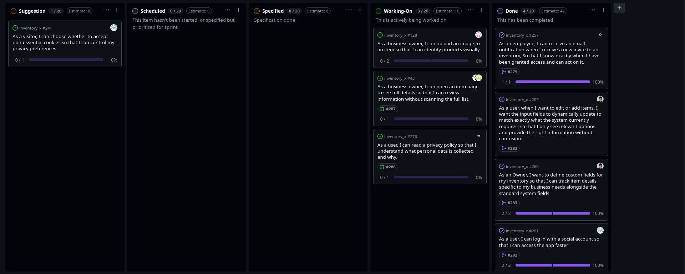

# Standup – 2026-04-21

## Purpose

The purpose of this standup was to synchronize progress, identify blockers, agree on next steps, and update the GitHub Project board.

## Summary

The team reviewed ongoing Sprint 5 work. The main work areas were custom fields, report writing, privacy policy, item descriptions, tests, item image upload, and rate limiting. One planned cookie banner user story was moved back to the backlog because the product did not yet use cookies in a way that made the feature necessary.

## Team updates

- Daniel had finished the custom fields user story and started working on assigned report tasks. No blockers were reported.
- Chai worked on the privacy policy page and had the content needed for the page. A pull request was expected soon.
- Ann-Hilde had added item descriptions and still needed to add tests. She also needed to update her branch from main, which was expected to take some time because of changes to item functionality.
- Lotte was working on the same area as Ann-Hilde.
- Knut-Åge had finished item image functionality, but the work depended on the branch used by Lotte and Ann-Hilde. There was still uncertainty about where images should be stored, since they were currently stored locally.
- Torgrim moved the cookie banner user story back to the backlog because cookies were not yet used in a way that required it. He had implemented rate limiting and created a k6 load test that also verified the rate limiting.

## Blockers

Knut-Åge had dependencies on the branch used by Lotte and Ann-Hilde, and image storage still needed clarification. Ann-Hilde and Lotte needed to update from main because of item-related changes. No other blockers were reported.

## Board update

The GitHub Project board was reviewed and updated during the meeting.

A board snapshot from this meeting is included below.

## Action items

- Continue report writing tasks.
- Create pull request for the privacy policy page.
- Add tests for item descriptions.
- Update branches from main where needed.
- Clarify image storage strategy.
- Keep the cookie banner user story in the backlog until cookies are actually used.
- Document or verify rate limiting and the k6 test results.
