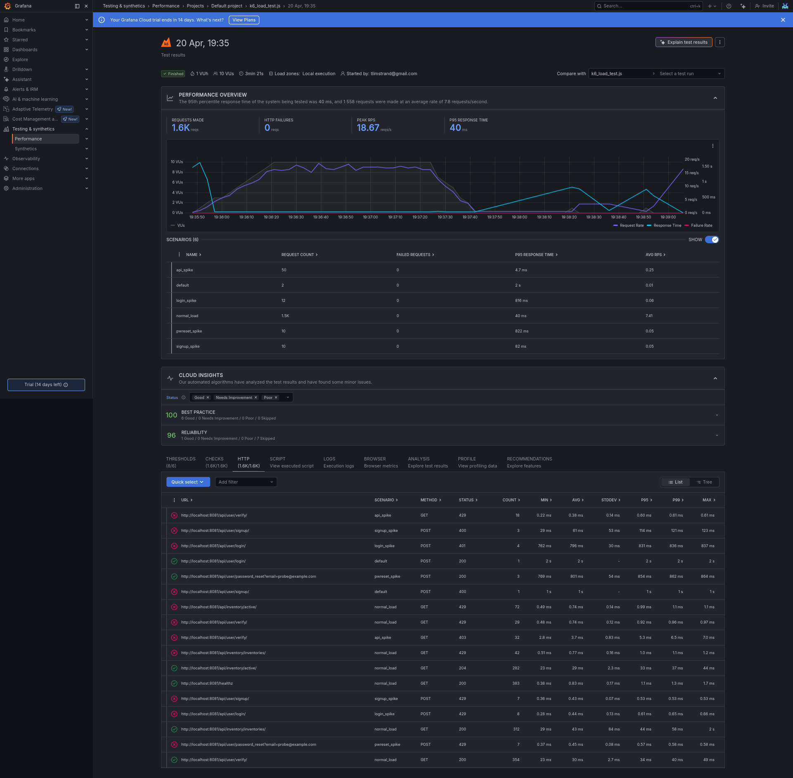
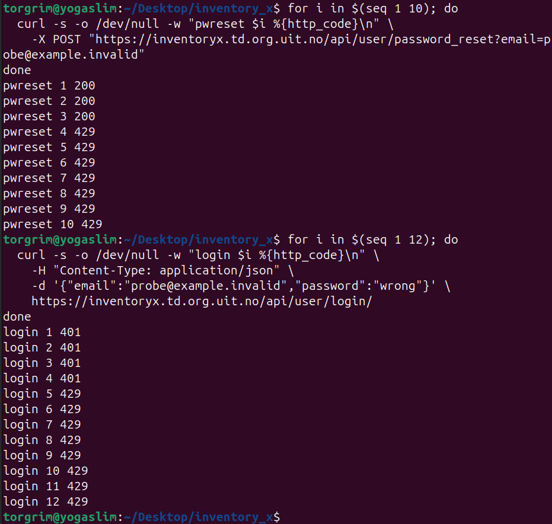

# Rate limiting documentation

Nginx rate limiting is configured in:

```text
deploy/nginx.prod.conf
deploy/nginx.prod.test.conf
```

The configuration protects authentication-related endpoints with stricter per-IP limits and applies a broader limit to the general API. Requests exceeding the configured limits return HTTP `429 Too Many Requests`.

## Rate limit configuration

The exact limits are project-specific conservative defaults rather than universal OWASP values. OWASP recommends throttling or rate limiting for authentication, password reset, and resource-consuming API endpoints. Nginx provides the concrete `limit_req` mechanism used here.

| Zone | Endpoint | Limit | Burst | Rationale |
|---|---|---:|---:|---|
| login | `POST /api/user/login/` | 5 req/min | 3 | Mitigates brute-force and credential-stuffing attempts |
| signup | `POST /api/user/signup/` | 2 req/min | 2 | Reduces automated account creation |
| pwreset | `/api/user/password_reset` | 2 req/min | 2 | Reduces password-reset and email-abuse attempts |
| api | `/api/` | 10 req/s | 30 | General API abuse and scraping protection |

## Test approach

The k6 test in `tests/rate_limit/k6_load_test.js` verifies rate limiting and performs a lightweight normal-load check.

The test covers two concerns:

1. Normal load: 10 virtual users ramp up, sustain traffic briefly, and ramp down.
2. Rate-limit verification: selected endpoints are flooded from a single virtual user to verify that Nginx returns `429 Too Many Requests`.

This is a combined lightweight load and rate-limit verification test. It is not intended as a full performance benchmark.

## Pass/fail thresholds

| Threshold | Requirement |
|---|---:|
| p95 response time during normal load | `< 2000 ms` |
| `normal_load_server_errors` counter | `0` |
| `login_rate_limited` counter | `>= 1` |
| `signup_rate_limited` counter | `>= 1` |
| `pwreset_rate_limited` counter | `>= 1` |
| `api_rate_limited` counter | `>= 1` |
## Run local test

Start the local prod-like stack:

```bash
docker compose -f deploy/docker-compose.prod.test.yml up -d
```

Run the k6 test:

```bash
BASE_URL=http://localhost:8081 k6 run tests/rate_limit/k6_load_test.js
```
To run locally while streaming results to Grafana Cloud k6:
```bash
BASE_URL=http://localhost:8081 k6 cloud run --local-execution tests/rate_limit/k6_load_test.js
```

## Production verification

The full k6 test is intended to be run against the local prod-like stack. This avoids unnecessary load and test data in production while still testing the production-style Nginx configuration.

After deploying the same Nginx rate-limit configuration to the production VM, the production endpoint was verified with small curl-based checks.

Password reset example:

```bash
for i in $(seq 1 10); do
  curl -s -o /dev/null -w "pwreset $i %{http_code}\n" \
    -X POST "https://inventoryx.td.org.uit.no/api/user/password_reset?email=probe@example.invalid"
done
```
Login example:
```bash
for i in $(seq 1 12); do
  curl -s -o /dev/null -w "login $i %{http_code}\n" \
    -H "Content-Type: application/json" \
    -d '{"email":"probe@example.invalid","password":"wrong"}' \
    https://inventoryx.td.org.uit.no/api/user/login/
done
```
Expected result: the first requests return normal application responses such as 200 or 401, and later requests return 429 Too Many Requests.

Ja, da bør README-en **ikke være avhengig av Grafana-lenken**. Bruk screenshot som permanent repo-bevis.

Bytt Evidence-delen til dette:


## Evidence

The rate-limit behavior was verified in two ways.

First, the full k6 test was run locally against the prod-like Docker stack while the results were viewed in Grafana Cloud k6. The test passed all configured thresholds, including response time, zero normal-load server errors, and at least one `429 Too Many Requests` response from each configured rate-limit zone.

- Target: `http://localhost:8081`
- Test file: `tests/rate_limit/k6_load_test.js`
- Result: PASS
- Thresholds: 6/6 passed
- HTTP failures: 0
- p95 response time: approximately 40 ms
- Requests: approximately 1.6k
- Stored evidence: `docs/testing/rate-limiting/results/k6-grafana-report.png`



Second, the same Nginx rate-limit configuration was deployed to the production VM and verified against the public production domain with small curl-based checks.

The production curl verification shows that password reset and login requests initially return normal application responses, and then return `429 Too Many Requests` after the configured limit is exceeded.

- Target: `https://inventoryx.td.org.uit.no`
- Stored evidence: `docs/testing/rate-limiting/results/prod-curl-rate-limit.png`



The `429 Too Many Requests` responses are expected and show that the configured Nginx rate limits were triggered in production.
urces

- Nginx `limit_req` module documentation: `limit_req_zone`, `limit_req`, `burst`, `nodelay`, and `limit_req_status`.
- OWASP Authentication Cheat Sheet: authentication endpoints should be protected against automated attacks.
- OWASP Forgot Password Cheat Sheet: password reset functionality should have protection such as rate limiting against automated attacks.
- OWASP API4:2023 Unrestricted Resource Consumption: APIs should enforce limits to reduce resource-exhaustion risk.
- OWASP REST Security Cheat Sheet: HTTP `429 Too Many Requests` is appropriate when a request is rejected due to rate limiting.